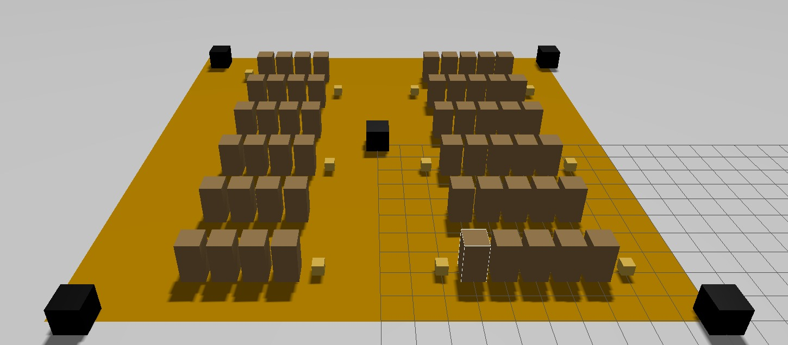
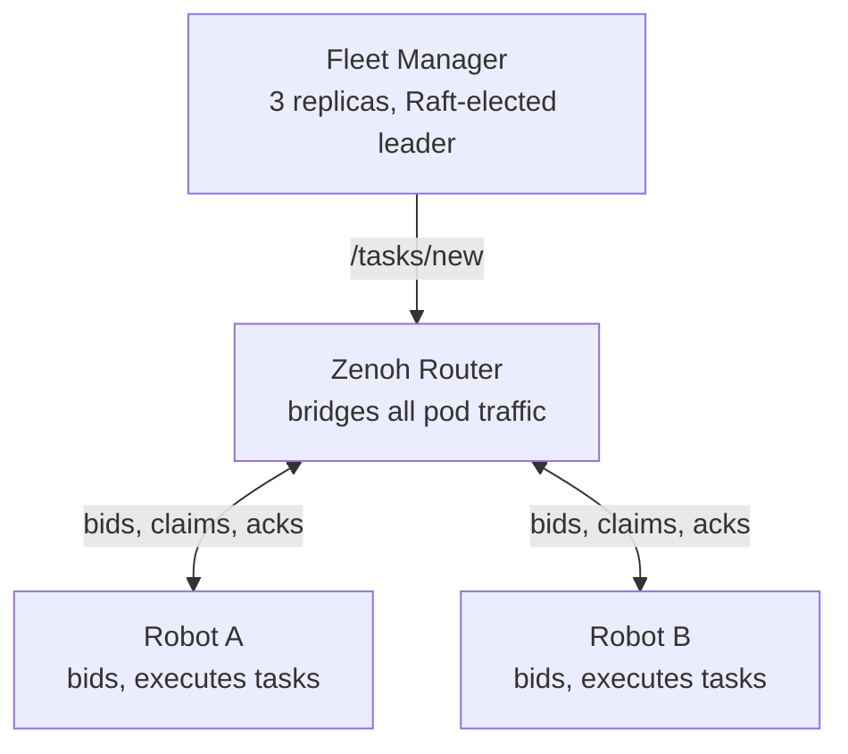
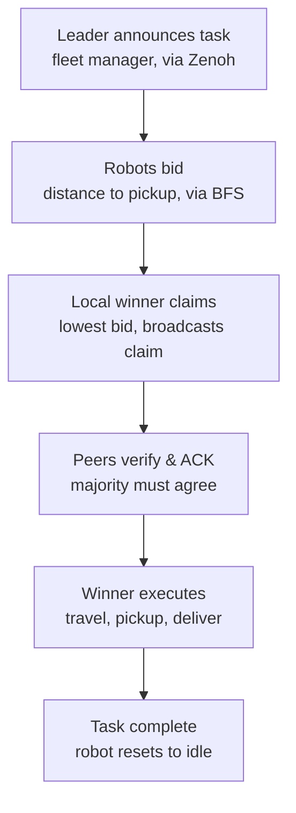

# Swarm-Fleet: Decentralized Multi-Robot Task Allocation on Kubernetes

A ROS 2 warehouse robot swarm that reaches task-allocation consensus without a
central coordinator, deployed to Kubernetes behind a Raft-elected, highly
available fleet manager. Built to explore two things at once: decentralized
coordination among peers, and fault-tolerant cloud infrastructure around them
— then chaos-tested to see which assumptions actually held.

---

## What it does

Robots bid on warehouse pickup/delivery tasks based on BFS-computed distance
around shelf obstacles. Instead of a dispatcher assigning work, every robot
independently reaches the same conclusion about who should do each task,
through a broadcast-and-verify protocol — and the whole system runs as
genuinely separate processes across Kubernetes pods, not just threads on one
machine.

- Fully decentralized bidding, claim, and majority-ACK consensus — no central
  dispatcher decides who does what
- BFS pathfinding around warehouse shelves, with real pickup → delivery
  execution and visual movement in Gazebo
- Robot discovery via heartbeat, with dead-robot pruning
- Containerized and deployed to `kind` (Kubernetes-in-Docker), with all
  cross-pod ROS 2 traffic bridged through Zenoh
- A 3-replica, Raft-elected fleet manager (task announcer) for high
  availability — killing the leader triggers automatic failover
- Chaos-tested: leader failover measured at **~7 seconds**, with the swarm
  continuing to bid, win, and complete tasks throughout the gap

---

## Architecture



Two entirely separate networks are at work here:

- **Port 7447, through Zenoh** — all ROS 2 traffic (`/tasks/new`,
  `/tasks/bids`, `/tasks/claims`, `/tasks/acks`, `/tasks/winner`,
  `/robots/discover`). Default ROS 2 DDS discovery does **not** cross
  Kubernetes pod network namespaces, confirmed by direct testing — this
  router is architecturally required, not a nice-to-have.
- **Port 4321, direct pod-to-pod** — Raft's own leader-election protocol
  between the three `fleet-manager` replicas, using their StatefulSet's
  stable DNS names. Nothing to do with ROS 2 or the swarm's own consensus.

### Life of a task



1. Whichever `fleet-manager` replica currently holds Raft leadership
   generates a random pickup/delivery task and publishes it.
2. Every free robot computes BFS distance from its current position to the
   pickup point and broadcasts a bid.
3. After a 5-second window, whichever robot sees itself as the local lowest
   bidder broadcasts a claim.
4. Every other robot compares that claim against its *own* bid before
   voting — the claimant needs a majority of ACKs before committing.
5. The winner marks itself busy, travels to pickup, then to delivery,
   carrying the box.
6. On completion, it resets to idle and broadcasts its availability.

---

## Tech stack

ROS 2 Jazzy (`rclpy`) · Gazebo (via `ros_gz`) · Docker · Kubernetes (`kind`)
· Zenoh (`rmw_zenoh_cpp`) · Raft consensus (`PySyncObj`) · Python 3

---

## Running it

### Local Gazebo demo (visual, single machine)

```bash
cd ros2_ws
colcon build --packages-select swarm_agent
source install/setup.bash
./run_swarm_test.sh
```

Spawns a warehouse (floor, shelves, boxes), 5 robot markers, a simple task
announcer, and 5 `agent_node` instances — watch them bid, win, and physically
carry boxes around shelf obstacles in the Gazebo window.

### Kubernetes deployment (the distributed-systems story)

```bash
# build and load the image
docker build -f docker/Dockerfile -t swarm-agent:latest .
kind create cluster --name swarm-cluster
kind load docker-image swarm-agent:latest --name swarm-cluster

# deploy
cd k8s
kubectl apply -f zenoh-router.yaml
kubectl apply -f fleet-manager.yaml
kubectl apply -f robot-a.yaml -f robot-b.yaml

kubectl get pods   # expect 6 pods: zenoh-router, fleet-manager-0/1/2, robot-a, robot-b
```

### Run the chaos tests

```bash
cd k8s
./chaos_test.sh
```

Kills the current Raft leader, measures failover time, then kills a robot
mid-task to document what happens to its in-progress work. Results and full
logs are saved to `chaos-test-results/`.

---

## Results — chaos testing

| Test | Result |
|---|---|
| Fleet-manager leader killed | New leader elected in **~7 seconds**; robots continued bidding and completing tasks throughout |
| Robot pod killed mid-task | Its in-progress task is **permanently lost** — confirmed via log trace, no retry or reassignment occurs |
| Leader failover, task IDs | Task-ID counter is **not** part of Raft's replicated state — a new leader restarts numbering from 0, a latent collision risk not yet triggered by timing luck |

Full timestamped logs for both tests are in `chaos-test-results/`.

---

## Design decisions worth knowing about

**Custom consensus for the swarm, Raft for the fleet manager — not the same
tool for both, on purpose.** The swarm's problem ("given a task, which robot
does it") structurally wants many participants acting; the fleet manager's
problem ("which replica announces the next task") structurally breaks with
more than one active writer. Different shape of problem, different solution.

**A majority-vote counterexample, found before it shipped.** An earlier
design had robots vote to confirm a claimant based on "is your bid worse than
theirs." Working through a 5-robot ranked example by hand showed that roughly
the *entire top half* of any ranked field can simultaneously clear a 50%
threshold — not just the true best bidder. The fix (comparing every in-flight
claim against every other claim, not just against one's own bid) is
essentially what Raft and Paxos exist to solve rigorously. Given the
timeline, the simpler bid+claim+ACK design was kept, with the residual risk
documented rather than hidden — and validated with real chaos tests rather
than assumed safe.

**Zenoh's default peer mode silently fails across Kubernetes pods.**
Confirmed by direct testing (not assumed): a Zenoh session advertises itself
at `localhost` for direct peer-to-peer data delivery — which is only
meaningful inside its own pod. The fix was forcing `mode="client"`, routing
all traffic through the shared router instead of attempting direct
connections that were doomed to fail.

**JSON over `std_msgs/String` instead of custom `.msg` types.** Trades
compile-time type safety for iteration speed — a deliberate call given the
project timeline, not an oversight.

---

## Known limitations

- No retry mechanism if a robot fails mid-task — the task is silently lost
  (confirmed via chaos testing, not just theorized)
- Task-ID generation is not part of Raft's replicated state, creating a
  latent collision risk across leader failover
- Majority-vote consensus reduces but does not fully eliminate
  double-assignment risk under simultaneous conflicting local views — a
  provably correct version requires either full per-claim cross-comparison
  or a proper multi-round protocol like CBBA
- Robot and box visuals are simple colored primitives, not detailed models

---

## What I'd do with more time

- Move task-ID generation into Raft's replicated state to close the
  collision risk
- Add a retry/reassignment mechanism for dropped tasks
- Implement full CBBA-style multi-round bid convergence for provable
  correctness under message loss
- Network-degradation chaos testing (packet loss via `tc netem`)
- Scaling tests at 10-50 robots

---

## Project structure

```
ros2_ws/src/swarm_agent/swarm_agent/
├── agent_node.py       decentralized robot: bid, claim, ACK, execute
├── fleet_manager.py    Raft-HA task announcer
├── task_publisher.py   simple announcer, used only by the local demo
├── layout.py           shared warehouse grid, shelves, boxes, deliveries
├── bfs.py              pathfinding
├── sim_control.py      Gazebo interaction (spawn, move)
└── spawn_decor.py      warehouse visuals

docker/       Dockerfile, entrypoint, fleet-manager startup script
k8s/          Kubernetes manifests, chaos test script
```
